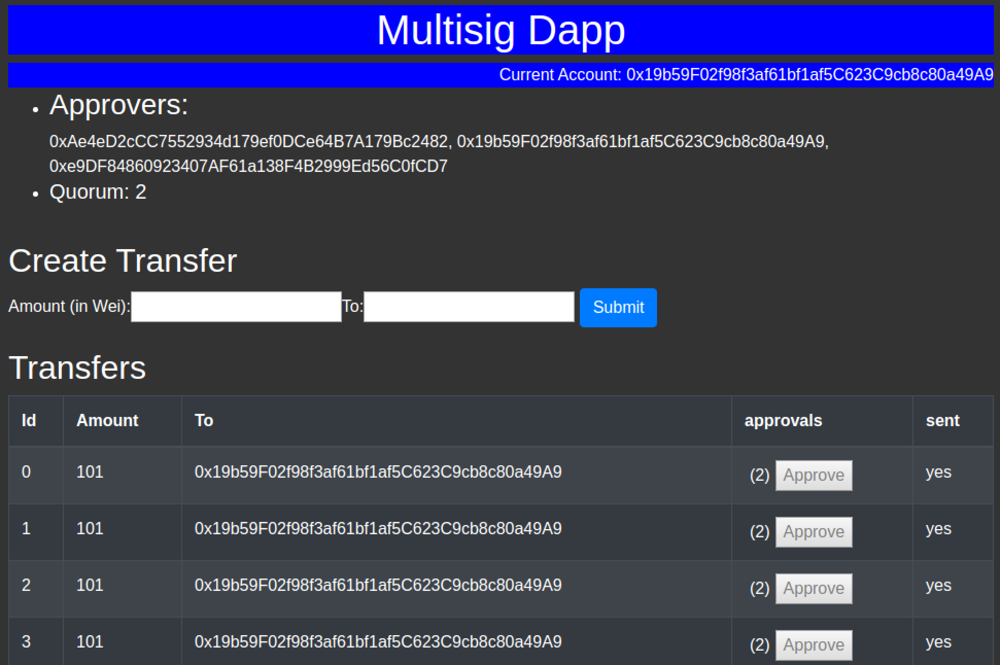

# Ethereum multi-signature wallet

## Summary: 
This app will allow transactions to be created that will send ether from one Ethereum account to another. The transaction will be displayed in a list with an approve button. A quorum of at least 2 out of 3 people must occur in order for funds to be transferred.

## Install all packages

`npm install` in client folder

## Testing on local machine

  `truffle test`

will run the tests that were written for the smart contract

## To run:

Make sure you have truffle installed, 

  `npm install -g truffle`

then run a development blockchain at the root of project,

  `truffle develop`

compile the contracts at the develop console,

  `truffle(develop)> compile`

then migrate and deploy the contracts

  `truffle(develop)> migrate`

make sure the MetaMask extension is installed for your browser. Import account into MetaMask using the seed phrase from the truffle console. Configure MetaMask to use local development blockchain (http://localhost:9545)

cd to the client folder and run,

  `npm start`

the app should load in your default browser at localhost:3000

_If having errors running npm, 
Restore ownership of the user's npm related folders, to the current user, like this:_

  `sudo chown -R $USER:$GROUP ~/.npm`

  `sudo chown -R $USER:$GROUP ~/.config`

## Using the app
First 3 accounts should be able to create and approve transfers. If there are errors, reset transaction history for the first 3 accounts in MetaMask. Click top right, then Settings, then Advanced, and Reset Account. 

Also, you can create a transaction to other accounts, but those other accounts cannot approve.

## Testing on kovan testnet
url: https://reverent-goodall-073e67.netlify.app/

These accounts are used to test the app and must be imported into MetaMask https://metamask.io/

0xf2a28e2922a91bf57274BF1477908f6BCA59Ae4E
883e2fcdec6064314c3e96b36dbd27d99afcd19ea8427281f5d4b5511d21f1c8

0xd57B9b73a7F8A174eb09342330d8Ece7E6242587
4e74784917654fc6d3dfa59533653912830c55f7d79a037535256b40edc68541

0x6aD093C7675A1b1AEB7e10c470ec0c64Ed81BCC8
dbf5a064f0a0aff431f6fddce276623f91f12eb7b0a0305e0158557095412838

(Wallet.sol 0x1cb8B81C88402a9764E70E6B03674f2eDC572f08)